<authentication_analysis>
- **Przepływy autentykacji**:
  - Rejestracja: `/signup` → `POST /api/auth/signup` → `supabase.auth.signUp`
  - Logowanie: `/login` → `POST /api/auth/login` → `supabase.auth.signInWithPassword`
  - Wylogowanie: `Header` → `POST /api/auth/logout` → `supabase.auth.signOut`
  - Reset hasła: `/reset-password` → `POST /api/auth/reset-password` → `supabase.auth.resetPasswordForEmail`
  - Dostęp do tras chronionych: middleware / SSR sprawdza `supabase.auth.getUser`
  - Obsługa wygaśnięcia sesji: API zwraca 401, UI przekierowuje na `/login`
- **Aktorzy**:
  - Przeglądarka (użytkownik), Middleware Astro, Astro API (`/api/auth/*`, API domenowe), Supabase Auth
- **Weryfikacja i odświeżanie tokenów**:
  - Supabase tworzy sesję i token JWT (`accessToken`, `expiresInSec`)
  - Backend używa `supabase.auth.getUser()` i RLS; po wygaśnięciu sesji zwraca 401
- **Kroki autentykacji (skrócone)**:
  - Walidacja JSON + Zod, wywołanie serwisu auth, mapowanie błędów na kody HTTP
  - Po sukcesie loginu: zapis sesji po stronie Supabase, redirect UI do `/`
  - Po wylogowaniu: usunięcie sesji, redirect do `/login`

```mermaid
sequenceDiagram
  autonumber

  participant Browser as "Przeglądarka"
  participant Middleware as "Middleware Astro"
  participant API as "Astro API"
  participant Supabase as "Supabase Auth"

  %% Rejestracja
  Browser->>Browser: Otwiera /signup (SignupForm)
  Browser->>API: POST /api/auth/signup (email, hasło)
  activate API
  API->>API: Walidacja JSON + authSignupSchema
  API->>Supabase: signUp(email, password)
  Supabase-->>API: Wynik rejestracji
  alt Rejestracja udana
    API-->>Browser: 201 Created (userId, email)
    Browser->>Browser: Komunikat sukcesu + redirect do /login
  else Duplikat email
    API-->>Browser: 409 Conflict (DUPLICATE_EMAIL)
    Browser->>Browser: Komunikat o istniejącym koncie
  else Błąd walidacji
    API-->>Browser: 422 Validation error
    Browser->>Browser: Komunikaty walidacyjne
  else Błąd serwera
    API-->>Browser: 500 Internal error
    Browser->>Browser: Ogólny komunikat o błędzie
  end
  deactivate API

  %% Logowanie
  Browser->>Browser: Otwiera /login (LoginForm)
  Browser->>API: POST /api/auth/login (email, hasło)
  activate API
  API->>API: Walidacja JSON + authLoginSchema
  API->>Supabase: signInWithPassword(email, password)
  Supabase-->>API: Sesja lub błąd
  alt Dane poprawne
    API-->>Browser: 200 OK (accessToken, expiresInSec)
    Browser->>Browser: Redirect do / (lista dni)
  else Niepoprawne dane
    API-->>Browser: 401 Unauthorized
    Browser->>Browser: Komunikat o błędnych danych
  else Błąd walidacji
    API-->>Browser: 422 Validation error
    Browser->>Browser: Komunikaty walidacyjne
  else Błąd serwera
    API-->>Browser: 500 Internal error
    Browser->>Browser: Ogólny komunikat o błędzie
  end
  deactivate API

  %% Dostęp do trasy chronionej (home, /dishes)
  Browser->>Middleware: GET / (widok chroniony)
  activate Middleware
  Middleware->>Supabase: getUser() dla sesji
  Supabase-->>Middleware: Użytkownik lub brak
  alt Brak sesji
    Middleware-->>Browser: 302 Redirect do /login
  else Sesja aktywna
    Middleware->>API: SSR / API domenowe
    API->>Supabase: Zapytania z RLS
    Supabase-->>API: Dane użytkownika
    API-->>Browser: HTML / JSON z danymi
  end
  deactivate Middleware

  %% Wylogowanie
  Browser->>Browser: Kliknięcie "Wyloguj" w Header
  Browser->>API: POST /api/auth/logout
  activate API
  API->>Supabase: getUser()
  Supabase-->>API: Użytkownik lub brak
  alt Użytkownik zalogowany
    API->>Supabase: signOut()
    Supabase-->>API: Wynik wylogowania
    API-->>Browser: 204 No Content
    Browser->>Browser: Redirect do /login
  else Brak sesji
    API-->>Browser: 401 Unauthorized
    Browser->>Browser: Pozostanie na ekranie logowania
  end
  deactivate API

  %% Reset hasła
  Browser->>Browser: Otwiera /reset-password (ResetPasswordForm)
  Browser->>API: POST /api/auth/reset-password (email)
  activate API
  API->>API: Walidacja JSON + authResetPasswordSchema
  API->>API: Wyliczenie redirectUrl do /auth/callback
  API->>Supabase: resetPasswordForEmail(email, redirectTo)
  Supabase-->>API: Sukces lub błąd
  API-->>Browser: 202 Accepted (zawsze)
  Browser->>Browser: Neutralny komunikat "Jeśli konto istnieje..."
  deactivate API

  %% Wygaśnięcie sesji / próba użycia wygasłej sesji
  Browser->>API: Żądanie do API domenowego z wygasłą sesją
  activate API
  API->>Supabase: getUser() / zapytanie do bazy
  Supabase-->>API: Brak użytkownika (sesja wygasła)
  API-->>Browser: 401 Unauthorized
  deactivate API
  Browser->>Browser: Przekierowanie do /login lub ekran "sesja wygasła"
```

</authentication_analysis>

<mermaid_diagram>

</mermaid_diagram>

