<architecture_analysis>

- **Komponenty Astro**:
  - `Layout.astro`, `AuthPageLayout.astro`
  - Strony: `login.astro`, `signup.astro`, docelowo `reset-password.astro`
  - Strony chronione: `index.astro` (home), `dishes/index.astro`, `dishes/[dishId]/edit.astro`
- **Komponenty React (auth)**:
  - `LoginForm`, `SignupForm`, docelowo `ResetPasswordForm`
  - `FormMessage` do komunikatów
- **Komponenty React (chronione widoki)**:
  - `Header` (nawigacja + wylogowanie)
  - `HomeView`, `DishesView`, `DishEditorOverlay`, `DayPlanOverlay`, `DishForm`, `DishList`
- **Warstwa API i logiki**:
  - Endpointy: `/api/auth/login`, `/api/auth/signup`, `/api/auth/logout`, `/api/auth/reset-password`
  - Serwis: `authService` (`signup`, `login`, `logout`, `resetPassword`)
  - Walidacja: `authSchemas` (Zod)
- **Główne strony i komponenty**:
  - `/login`: `Layout` → `AuthPageLayout` → `LoginForm`
  - `/signup`: `Layout` → `AuthPageLayout` → `SignupForm`
  - `/reset-password` (docelowo): `Layout` → `AuthPageLayout` → `ResetPasswordForm`
  - `/` (home): `Layout` (+ `Header`) → `HomeView`
  - `/dishes`: `Layout` (+ `Header`) → `DishesView` → `DishList` / `DishForm`
  - `/dishes/[dishId]/edit`: `Layout` (+ `Header`) → `DishEditorOverlay`
- **Przepływ danych (wysoki poziom)**:
  - Formularze auth (React) → fetch do `/api/auth/*` → walidacja Zod → serwis `authService` → `supabase.auth.*`
  - Widoki chronione (React) → API domenowe (`/api/dishes`, `/api/day-plans`) → Supabase z RLS
- **Krótki opis komponentów**:
  - `AuthPageLayout`: szablon stron auth (tytuł, podtytuł, linki pomocnicze)
  - `LoginForm` / `SignupForm`: lokalny stan, walidacja, obsługa błędów i sukcesu, przekierowania
  - `ResetPasswordForm` (docelowo): formularz email + komunikat neutralny
  - `Header`: nawigacja główna, przycisk „Wyloguj” z wywołaniem `/api/auth/logout`
  - `HomeView` / `DishesView` i edytory: logika planowania i bazy dań, działają tylko po zalogowaniu

```mermaid
flowchart TD

  %% Warstwa Astro
  subgraph "Warstwa Astro (SSR i routing)"
    A_Layout["Layout.astro"]
    A_AuthLayout["AuthPageLayout.astro"]
    P_Login["/login - login.astro"]
    P_Signup["/signup - signup.astro"]
    P_Reset["/reset-password - reset-password.astro (docelowo)"]
    P_Home["/ - index.astro"]
    P_Dishes["/dishes - dishes/index.astro"]
    P_DishEdit["/dishes/[id]/edit - edit.astro"]
  end

  %% Komponenty React - auth
  subgraph "Komponenty React - Autentykacja"
    R_LoginForm["LoginForm"]
    R_SignupForm["SignupForm"]
    R_ResetForm["ResetPasswordForm (docelowo)"]
    R_FormMessage["FormMessage"]
  end

  %% Komponenty React - aplikacja
  subgraph "Komponenty React - Widoki chronione"
    R_Header["Header (nawigacja + wylogowanie)"]
    R_HomeView["HomeView"]
    R_DishesView["DishesView"]
    R_DishEditor["DishEditorOverlay"]
    R_DayPlan["DayPlanOverlay"]
    R_DishForm["DishForm"]
    R_DishList["DishList"]
  end

  %% Warstwa API auth
  subgraph "API autentykacji i logika"
    API_Login["POST /api/auth/login"]
    API_Signup["POST /api/auth/signup"]
    API_Logout["POST /api/auth/logout"]
    API_Reset["POST /api/auth/reset-password"]
    S_AuthService["authService (signup, login, logout, resetPassword)"]
    V_AuthSchemas["authSchemas (Zod)"]
  end

  %% Supabase
  S_Supabase["Supabase Auth + baza z RLS"]

  %% Powiązania Astro -> React
  P_Login --> A_Layout
  P_Login --> A_AuthLayout
  P_Login --> R_LoginForm

  P_Signup --> A_Layout
  P_Signup --> A_AuthLayout
  P_Signup --> R_SignupForm

  P_Reset --> A_Layout
  P_Reset --> A_AuthLayout
  P_Reset --> R_ResetForm

  P_Home --> A_Layout
  P_Home --> R_Header
  P_Home --> R_HomeView

  P_Dishes --> A_Layout
  P_Dishes --> R_Header
  P_Dishes --> R_DishesView
  R_DishesView --> R_DishList
  R_DishesView --> R_DishForm

  P_DishEdit --> A_Layout
  P_DishEdit --> R_Header
  P_DishEdit --> R_DishEditor

  %% Przepływ danych z formularzy auth
  R_LoginForm -- "fetch POST /api/auth/login" --> API_Login
  R_SignupForm -- "fetch POST /api/auth/signup" --> API_Signup
  R_ResetForm -- "fetch POST /api/auth/reset-password" --> API_Reset
  R_Header -- "POST /api/auth/logout" --> API_Logout

  API_Login --> V_AuthSchemas
  API_Signup --> V_AuthSchemas
  API_Reset --> V_AuthSchemas

  API_Login --> S_AuthService
  API_Signup --> S_AuthService
  API_Logout --> S_AuthService
  API_Reset --> S_AuthService

  S_AuthService --> S_Supabase

  %% Widoki chronione -> API domenowe (uproszczone)
  subgraph "API domenowe (uproszczenie)"
    API_Dishes["/api/dishes/*"]
    API_DayPlans["/api/day-plans/*"]
  end

  R_HomeView -- "fetch /api/day-plans" --> API_DayPlans
  R_DishesView -- "fetch /api/dishes" --> API_Dishes
  R_DishEditor -- "mutacje dań" --> API_Dishes

  API_Dishes --> S_Supabase
  API_DayPlans --> S_Supabase

  %% Oznaczenie elementów nowych / zaktualizowanych
  classDef updated fill:#f9f,stroke:#c0c,stroke-width:2px;
  class P_Reset,R_ResetForm,API_Reset updated;
```

    </architecture_analysis>

<mermaid_diagram>

</mermaid_diagram>
